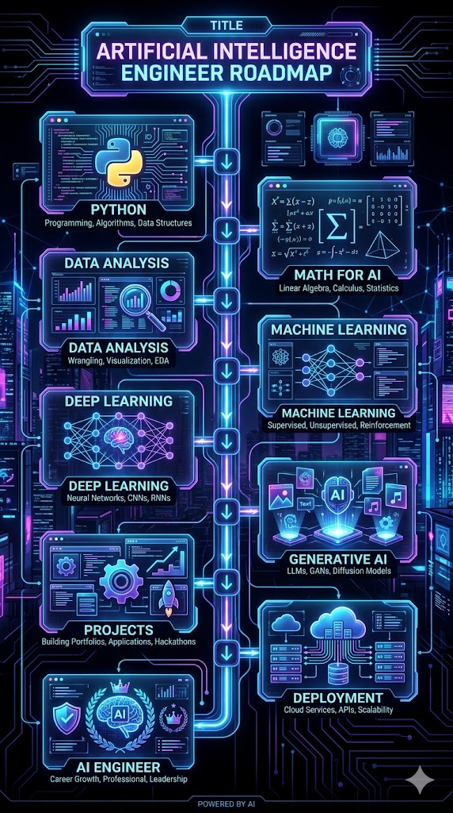

# 🚀 AI Roadmap For Beginners

> A complete step-by-step roadmap to become an AI Engineer in 2026.

---

---

# 📈 GitHub Stats 

  
 

  
 

--- 

# 🔥 GitHub Streak

  

## 📌 What You'll Learn

- [Python](#1️⃣-learn-python)
- [Mathematics](#2️⃣-learn-mathematics)
- [Data Analysis](#3️⃣-data-analysis)
- [Machine Learning](#4️⃣-machine-learning)
- [Deep Learning](#5️⃣-deep-learning)
- [Generative AI](#6️⃣-generative-ai)
- [Projects](#7️⃣-build-projects)
- [Deployment](#8️⃣-deployment)

---

# 🛣️ AI Learning Roadmap

## 1️⃣ Learn Python

### Topics
- Variables
- Loops
- Functions
- OOP
- File Handling

### Resources
- Python.org
- FreeCodeCamp
- Corey Schafer

---

## 2️⃣ Learn Mathematics

### Important Topics
- Linear Algebra
- Probability
- Statistics
- Calculus Basics

---

## 3️⃣ Data Analysis

### Libraries
- NumPy
- Pandas
- Matplotlib
- Seaborn

### Projects
- Data Cleaning
- Data Visualization

---

## 4️⃣ Machine Learning

### Learn
- Supervised Learning
- Unsupervised Learning
- Regression
- Classification

### Libraries
- Scikit-learn

---

## 5️⃣ Deep Learning

### Topics
- Neural Networks
- CNN
- RNN
- Transformers

### Frameworks
- TensorFlow
- PyTorch

---

## 6️⃣ Generative AI

### Learn
- LLMs
- Prompt Engineering
- RAG
- AI Agents
- LangChain

---

## 7️⃣ Build Projects

### Beginner Projects
- Spam Classifier
- Chatbot
- Resume Analyzer
- Movie Recommendation System

---

## 8️⃣ Deployment

### Learn
- Streamlit
- Flask
- Hugging Face
- Docker Basics

---

# 📚 Recommended Resources

| Topic | Resource |
|---|---|
| Python | FreeCodeCamp |
| ML | Andrew Ng |
| Deep Learning | FastAI |
| GenAI | OpenAI Docs |

---

# 🤝 Contributions Welcome

Feel free to fork this repository and improve it.

---

# ⭐ Support

If you found this roadmap useful, give it a star ⭐
